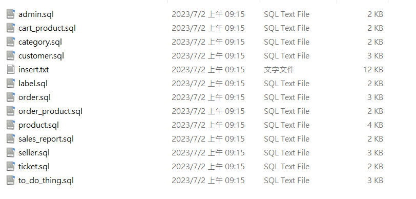

## 基於 Vue + Flask + MySQL 開發出一套 C2C 的拍賣平台「邀驗鑑貨」共同打造出畫面人性化、操作簡單易懂的拍賣平台。 主要負責後端部分
### 使用說明

### 將 **insert_data** 資料夾內檔案匯入資料庫



### 安裝必要檔案

```python
pip install -r requirements.txt
```

### 執行WSS.py

```python
python WSS.py
```

